# Quantum Circuit Editor - High-Level Architecture (Updated)

## 1. Introduction

This document outlines the high-level architecture for the Quantum Circuit Editor MVP, an educational tool for students and quantum computing enthusiasts with little to no prior quantum computing or programming experience. The architecture described here is designed to fulfill the functional requirements specified in the MVP documentation while providing a foundation that can scale for future enhancements.

This is an updated version that addresses the review feedback from the architecture review document.

## 2. Key Use Cases

Before diving into the technical architecture, it's important to understand the primary use cases that drive the system design. These use cases represent the core interactions that users will have with the Quantum Circuit Editor.

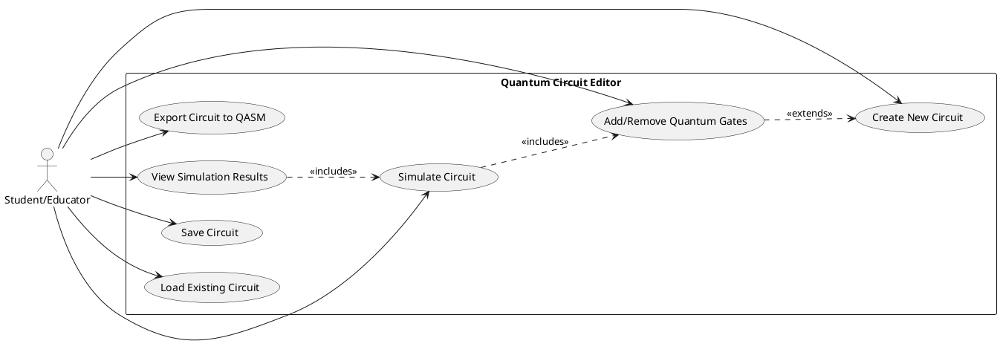

### 2.1 Primary Use Cases

1. **Create New Circuit**
   - User creates a blank quantum circuit with 2-5 qubits
   - User sets basic circuit parameters (e.g., number of qubits)
   - System displays an empty circuit with the specified number of qubit lines

2. **Add/Remove Quantum Gates**
   - User drags quantum gates (X, Y, Z, H, CNOT) from the gate palette onto qubit lines
   - User removes gates by dragging them off the circuit or using a delete function
   - User repositions gates on the circuit canvas
   - System provides visual feedback during the drag-and-drop operations
   - System validates gate placement and connections

3. **Simulate Circuit**
   - User clicks a "Simulate" button to run the quantum simulation
   - System processes the circuit through the simulation engine
   - System calculates the quantum state and measurement probabilities
   - System indicates simulation progress during calculation

4. **View Simulation Results**
   - System displays the probability distribution of possible measurement outcomes
   - User interprets the simulation results to understand circuit behavior
   - User can toggle between different visualization modes (if available in MVP)

5. **Save Circuit**
   - User saves the current circuit design to their account
   - User provides a name and optional description for the circuit
   - System confirms successful save operation
   - System associates the circuit with the user's account

6. **Load Existing Circuit**
   - User views a list of their previously saved circuits
   - User selects a circuit to load
   - System loads the circuit data and displays it on the canvas
   - User continues editing the loaded circuit

7. **Export Circuit to QASM**
   - User exports the current circuit to QASM format
   - System generates the QASM representation of the circuit
   - User downloads or copies the QASM code for use in other tools

### 2.2 User Flows

The following sequence diagrams illustrate the typical flow for two key user journeys:

#### 2.2.1 Circuit Design and Simulation Flow

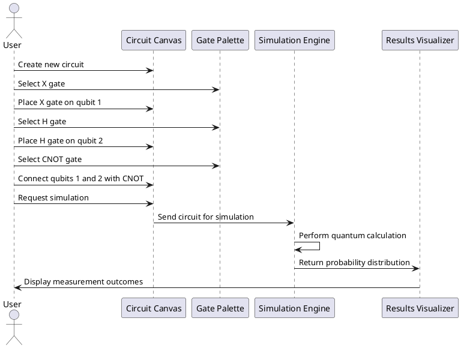

#### 2.2.2 Save and Export Flow

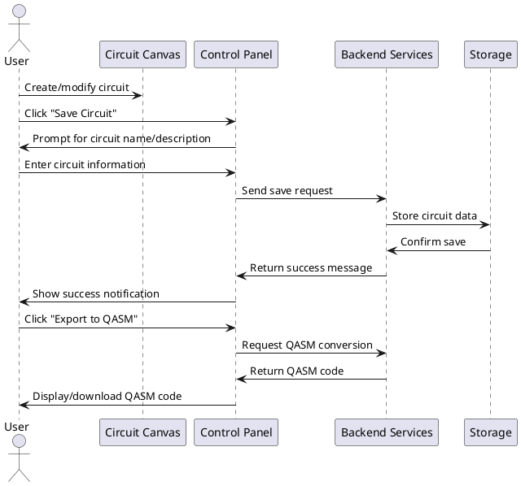

## 3. System Overview

The Quantum Circuit Editor is a web-based application that enables users to:
- Create and edit quantum circuits through a drag-and-drop interface
- Simulate small quantum circuits (2-5 qubits)
- Visualize simulation results as probability distributions
- Save, load, and export circuit designs

### 3.1 Architectural Approach: Simplified Monolith for MVP

Based on the architecture review, we're adopting a simplified monolithic approach for the MVP to reduce complexity and accelerate development:

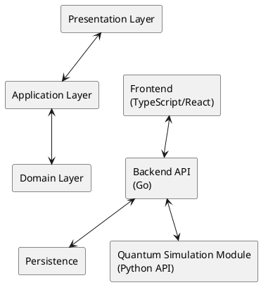

### 3.2 Technology Stack Justification

While we're using three different languages (TypeScript, Go, Python), this is based on the following justifications:

- **Frontend (TypeScript/React)**: Team has strong expertise and the interactive nature of the application requires a robust UI framework
- **Backend (Go)**: Team has expertise in Go, which offers excellent performance for web services and API handling
- **Simulation (Python)**: Leveraging existing Python quantum computing libraries (like Qiskit or Cirq) rather than building simulation capabilities from scratch

### 3.3 Cross-Language Integration Strategy

To mitigate the complexity of the multi-language approach, we'll implement:

- A clean, well-defined API between components
- A simple REST API for Frontend-Backend communication
- Python simulation code exposed as a straightforward HTTP service
- Comprehensive integration tests and documentation

## 4. Component Architecture

### 4.1 Frontend (TypeScript + React)

The frontend is responsible for the user interface and direct user interactions. It is built using TypeScript and React to leverage the team's expertise.

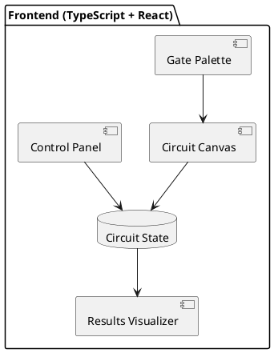

Key components:
- **Circuit Canvas**: The main workspace for circuit design and visualization
- **Gate Palette**: Collection of available quantum gates (X, Y, Z, H, CNOT)
- **Control Panel**: Interface for simulation control, saving, loading, and exporting
- **Results Visualizer**: Component for displaying simulation results as probability distributions

State management will be handled using React's built-in state management capabilities, with a centralized state for the circuit representation.

#### 4.1.1 State Management Strategy

For the MVP, we'll use React Context API combined with useReducer for managing the quantum circuit state:

```typescript
// Simplified state management approach
interface CircuitState {
  qubits: number;
  gates: Gate[];
  simulationResults: SimulationResult | null;
  isDirty: boolean;
  history: CircuitHistoryState[];
  historyIndex: number;
}

// Actions for state management
type CircuitAction =
  | { type: 'ADD_GATE', gate: Gate }
  | { type: 'REMOVE_GATE', gateId: string }
  | { type: 'MOVE_GATE', gateId: string, newPosition: Position }
  | { type: 'SET_SIMULATION_RESULTS', results: SimulationResult }
  | { type: 'UNDO' }
  | { type: 'REDO' };
```

This approach provides:
- Circuit state tracking
- Undo/redo functionality
- Change detection for save prompts
- Centralized state for all components

### 4.2 Backend Services (Go)

The backend services handle business logic, user authentication, and coordination between the frontend and the quantum simulation engine.

For the MVP, we'll implement a simplified monolithic backend in Go:

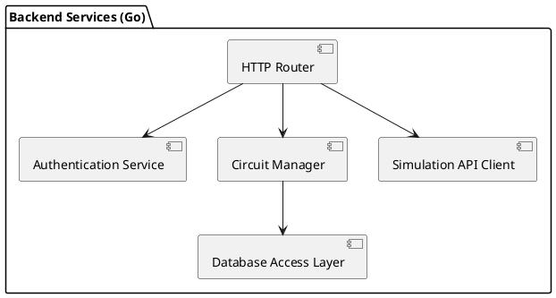

Key components:
- **HTTP Router**: Entry point for frontend requests
- **Authentication Service**: Manages user authentication with Google
- **Circuit Manager**: Handles saving, loading, and validating circuit designs
- **Simulation API Client**: Communicates with the Python simulation service
- **Database Access Layer**: Handles persistence operations

#### 4.2.1 API Endpoints

The backend will expose the following RESTful endpoints:

| Endpoint | Method | Description |
|----------|--------|-------------|
| `/api/auth/login` | POST | Authenticate user with Google |
| `/api/auth/logout` | POST | Log out current user |
| `/api/circuits` | GET | Get list of user's circuits |
| `/api/circuits` | POST | Create new circuit |
| `/api/circuits/{id}` | GET | Get specific circuit |
| `/api/circuits/{id}` | PUT | Update circuit |
| `/api/circuits/{id}` | DELETE | Delete circuit |
| `/api/simulate` | POST | Run circuit simulation |
| `/api/export/qasm` | POST | Convert circuit to QASM |

### 4.3 Quantum Simulation Module (Python)

The quantum simulation engine is responsible for the scientific calculations required to simulate quantum circuits.

The simulation module will be a lightweight HTTP service exposing Python-based quantum simulation:

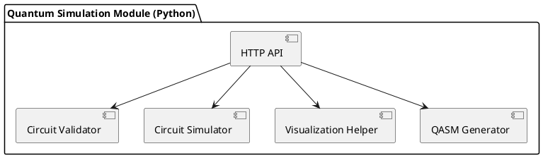

#### 4.3.1 Simulation Performance Considerations

For the MVP with 2-5 qubits:
- State vectors are manageable (2^5 = 32 amplitudes)
- Matrix operations use NumPy for optimization
- Precomputed gate operations reduce calculation time
- Response time targets < 500ms for typical circuits

We'll leverage an existing quantum computing library like Qiskit, which is optimized for these types of calculations.

## 5. Data Architecture

### 5.1 Circuit Data Model

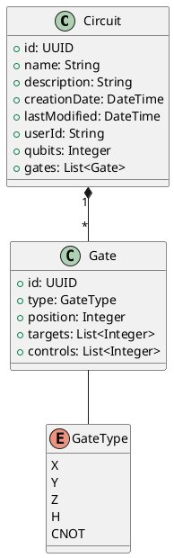

### 5.2 Database Selection: PostgreSQL

For the MVP, we'll use PostgreSQL as our database for several reasons:
- Strong support for JSON data types (for storing circuit configurations)
- ACID compliance for data integrity
- Excellent support in Go ecosystem
- Familiar to the development team
- Easy to host in cloud environments

## 6. Integration Architecture

### 6.1 Frontend-Backend Integration

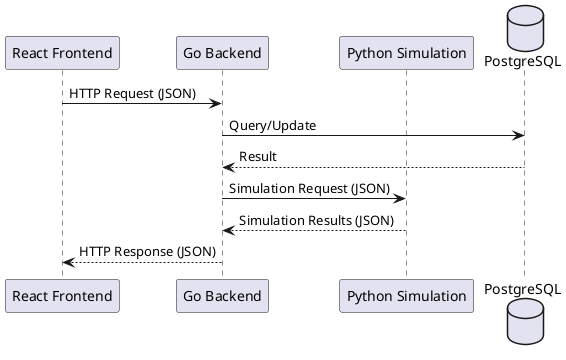

### 6.2 Authentication Flow

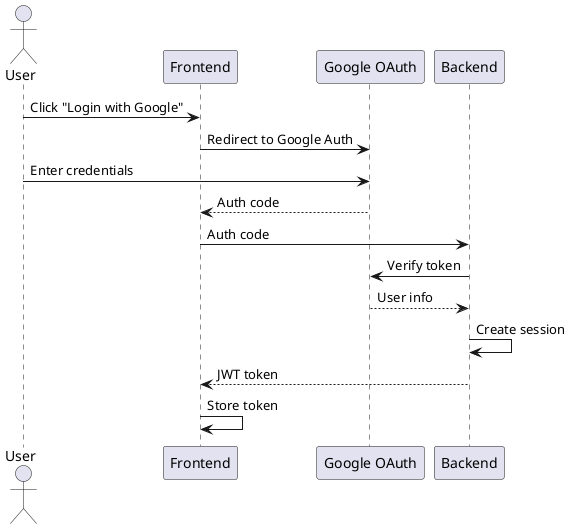

## 7. Deployment Architecture

For the MVP, we'll use a simplified deployment architecture:

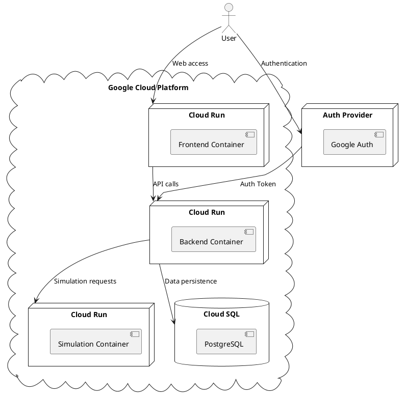

### 7.1 Resource Estimates

| Component | Resources | Estimated Monthly Cost |
|-----------|-----------|------------------------|
| Frontend | 1 Cloud Run instance | ~$15-30 |
| Backend | 1 Cloud Run instance | ~$15-30 |
| Simulation | 1 Cloud Run instance | ~$20-40 |
| Database | Small Cloud SQL instance | ~$25-50 |
| Storage | 10GB | ~$2-5 |
| **Total** | | **~$77-155** |

This estimate assumes modest usage for an educational MVP. Actual costs will depend on traffic patterns.

## 8. Security Considerations

### 8.1 Authentication and Authorization

- User authentication via Google OAuth 2.0
- JWT tokens for session management
- Role-based access control for circuit ownership
- HTTPS for all communications
- API rate limiting to prevent abuse

### 8.2 Data Protection

- Encryption at rest for database
- Input validation and sanitization for all API endpoints
- CSRF protection for web forms
- Security headers for frontend (Content Security Policy, etc.)

## 9. Error Handling

### 9.1 Frontend Error Handling

- Graceful error displays for users
- Connectivity loss handling with retry mechanisms
- Form validation with clear user feedback
- Client-side validation to catch errors early

### 9.2 Backend Error Handling

- Structured error responses (status code, message, details)
- Comprehensive error logging
- Graceful degradation when simulation service is unavailable
- Rate limiting with appropriate error messages

### 9.3 Simulation Error Handling

- Validation of circuit configurations before simulation
- Timeouts for long-running simulations
- Graceful error messages for invalid quantum operations

## 10. Testing Strategy

### 10.1 Frontend Testing

- Unit tests for React components using Jest and React Testing Library
- Integration tests for state management logic
- End-to-end tests using Cypress for critical user flows

### 10.2 Backend Testing

- Unit tests for business logic and API handlers
- Integration tests for database operations
- API contract tests to verify endpoint behavior

### 10.3 Simulation Testing

- Unit tests for quantum operations
- Validation tests against known quantum circuits with verified outputs
- Performance tests for various circuit sizes

## 11. Monitoring and Observability

### 11.1 Application Monitoring

- Request/response metrics for API endpoints
- Error rate tracking
- User activity metrics (circuits created, simulations run)
- Performance metrics for simulation operations

### 11.2 Infrastructure Monitoring

- CPU/memory usage for services
- Database performance metrics
- API latency tracking
- Error logs aggregation

We'll implement monitoring using Google Cloud Monitoring for the MVP.

## 12. Local Development Setup

For local development, we'll provide:

- Docker Compose configuration for running all services locally
- Development documentation with setup instructions
- Seeded database with sample circuits
- Environment configuration templates
- Local authentication bypass option for easier development

## 13. Technical Trade-offs and Alternatives

### 13.1 Technology Stack Alternatives Considered

| Component | Selected | Alternatives | Rationale |
|-----------|----------|--------------|-----------|
| Frontend | React + TypeScript | Vue.js, Angular | Team expertise, strong ecosystem |
| Backend | Go | Node.js, Python | Team expertise, performance |
| Simulation | Python | Julia, C++ | Existing libraries, scientific computing strength |
| Database | PostgreSQL | MongoDB, MySQL | JSON support, reliability |

### 13.2 Architecture Alternatives

| Aspect | Selected | Alternative | Rationale |
|--------|----------|-------------|-----------|
| Overall Architecture | Simplified Monolith | Microservices | Reduced complexity for MVP |
| Frontend State | Context+Reducer | Redux, MobX | Simpler learning curve, sufficient for MVP |
| API Style | REST | GraphQL | Familiarity, simplicity |
| Deployment | Cloud Run | Kubernetes | Easier operations, automatic scaling |

## 14. Future Extensibility

The architecture is designed to accommodate future enhancements:
- Support for additional quantum gates
- Integration with real quantum hardware
- More advanced visualization features
- Collaboration features

### 14.1 Potential Scaling Considerations

- Separating services for better scalability when needed
- Adding caching for frequently accessed circuits
- Optimizing database queries as the number of users grows
- Adding more sophisticated authentication and sharing options

## 15. Open Questions and Next Steps

### 15.1 Open Questions

- What are typical classroom usage patterns that might create usage spikes?
- What level of detail should be provided in the tutorial system?
- How important is real-time collaboration for educational use cases?

### 15.2 Next Steps

1. Finalize database schema design
2. Create detailed API specifications
3. Develop proof-of-concept for quantum simulation service
4. Implement authentication flow
5. Create UI mockups and component structure

## 16. Conclusion

This updated architecture document provides a balanced approach for the Quantum Circuit Editor MVP, addressing the review concerns while maintaining the core educational objectives of the application. By simplifying the deployment architecture, clarifying cross-service communication, and providing more detailed implementation guidance, we've created a more feasible plan for delivering a valuable educational tool.
