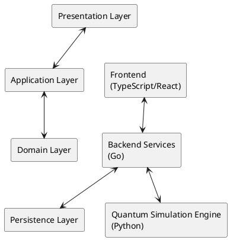
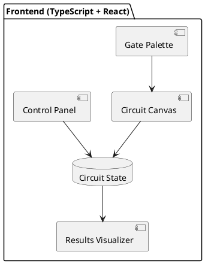
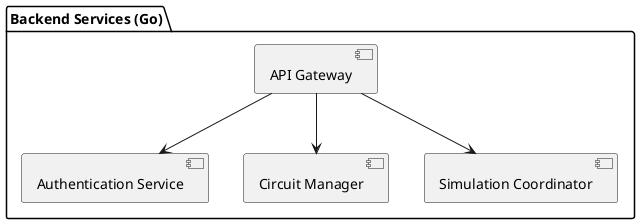
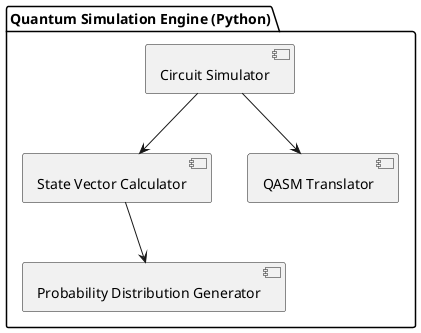
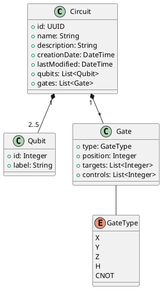
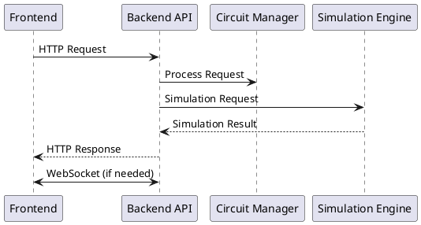
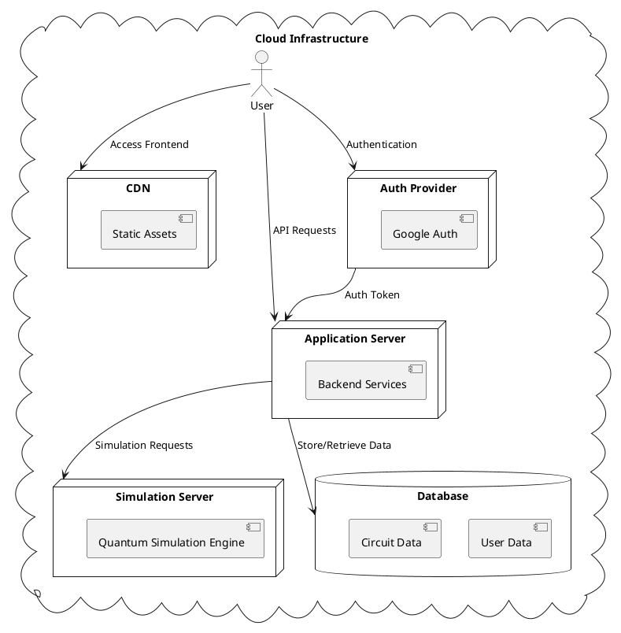

# Quantum Circuit Editor - High-Level Architecture

## 1. Introduction

This document outlines the high-level architecture for the Quantum Circuit Editor MVP, an educational tool for students and quantum computing enthusiasts with little to no prior quantum computing or programming experience. The architecture described here is designed to fulfill the functional requirements specified in the MVP documentation while providing a foundation that can scale for future enhancements.

## 2. System Overview

The Quantum Circuit Editor is a web-based application that enables users to:
- Create and edit quantum circuits through a drag-and-drop interface
- Simulate small quantum circuits (2-5 qubits)
- Visualize simulation results as probability distributions
- Save, load, and export circuit designs

The system architecture follows a multi-tier approach with clear separation of concerns:

## 3. Component Architecture

### 3.1 Frontend (TypeScript + React)

The frontend is responsible for the user interface and direct user interactions. It is built using TypeScript and React to leverage the team's expertise.

Key components:
- **Circuit Canvas**: The main workspace for circuit design and visualization
- **Gate Palette**: Collection of available quantum gates (X, Y, Z, H, CNOT)
- **Control Panel**: Interface for simulation control, saving, loading, and exporting
- **Results Visualizer**: Component for displaying simulation results as probability distributions

State management will be handled using React's built-in state management capabilities, with a centralized state for the circuit representation.

TODO: Define specific React component hierarchy and interactions. Consider whether a state management library is needed for more complex state.

### 3.2 Backend Services (Go)

The backend services handle business logic, user authentication, and coordination between the frontend and the quantum simulation engine.

Key components:
- **API Gateway**: Entry point for frontend requests
- **Authentication Service**: Manages user authentication with Google or similar services
- **Circuit Manager**: Handles saving, loading, and validating circuit designs
- **Simulation Coordinator**: Coordinates simulation requests and results

TODO: Define API endpoints and service boundaries in more detail. Consider security measures for the API.

### 3.3 Quantum Simulation Engine (Python)

The quantum simulation engine is responsible for the scientific calculations required to simulate quantum circuits.

Key components:
- **Circuit Simulator**: Core component that executes the quantum circuit simulation
- **State Vector Calculator**: Calculates the quantum state vector based on the circuit
- **Probability Distribution Generator**: Generates measurement outcome probabilities
- **QASM Translator**: Handles export to QASM format

TODO: Research existing Python libraries for quantum simulation that could be leveraged. Define optimization strategies for matrix operations.

## 4. Data Architecture

### 4.1 Circuit Data Model

The quantum circuit is the central data structure in the system:
- **Qubits**: Representation of quantum bits (2-5 for MVP)
- **Gates**: Quantum operations (X, Y, Z, H, CNOT)
- **Connections**: Relationships between gates and qubits
- **Metadata**: Information about the circuit (name, description, creation date)

### 4.2 Storage Solution

The system will use a database to store:
- User information
- Circuit designs
- Simulation results (optional)

TODO: Decide on specific database technology based on scalability needs and team expertise.

## 5. Integration Architecture

### 5.1 Frontend-Backend Integration

Communication between the frontend and backend will be achieved through:
- RESTful API for standard operations
- WebSocket for real-time updates (if needed)

### 5.2 Backend-Simulation Integration

The Go backend will integrate with the Python simulation engine through:
- A well-defined API contract
- Serialized data format (JSON or Protocol Buffers)

TODO: Evaluate performance implications of cross-language integration and determine the most efficient approach.

## 6. Deployment Architecture

The system will be deployed as a cloud-based web application:
- Frontend assets served from a CDN
- Backend services deployed as containerized applications
- Simulation engine deployed as a separate service

Authentication will be implemented using Google or similar third-party providers.

TODO: Define specific cloud infrastructure components and configuration. Research cost-effective hosting solutions for educational use cases.

## 7. Security Considerations

### 7.1 Authentication and Authorization

- User authentication via Google or similar services
- Basic authorization for accessing own circuits

### 7.2 Data Protection

- Secure storage of user data
- HTTPS for all communications

TODO: Conduct a more thorough security analysis and identify potential vulnerabilities.

## 8. Performance Considerations

While exact performance metrics are not critical for the MVP, the architecture should:
- Support responsive UI interactions
- Handle simulation of small circuits (2-5 qubits) efficiently
- Support multiple concurrent users

TODO: Define performance benchmarks and optimization strategies, especially for the simulation engine.

## 9. Future Extensibility

The architecture is designed to accommodate future enhancements:
- Support for additional quantum gates
- Integration with real quantum hardware
- More advanced visualization features
- Collaboration features

TODO: Identify potential bottlenecks that might limit scalability.

## 10. Open Questions and Considerations

- Should the simulation be performed client-side or server-side?
- What is the expected user load and how will this affect infrastructure needs?
- How should we handle error cases in simulation (invalid circuits, etc.)?
- What level of detail should be provided in the tutorial system?

TODO: Schedule architecture review meeting to discuss these open questions with the product and development teams.