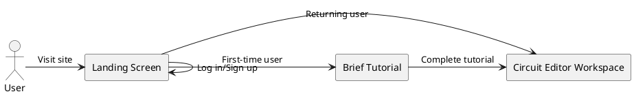
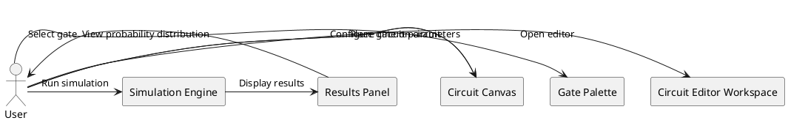
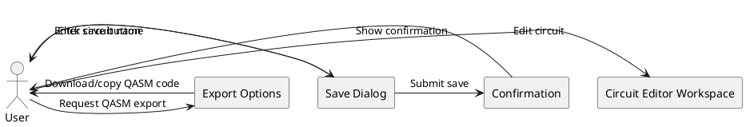
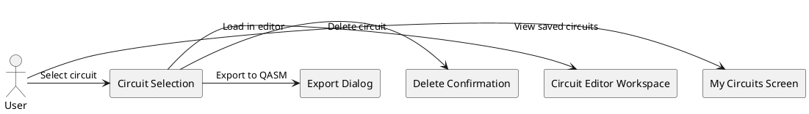
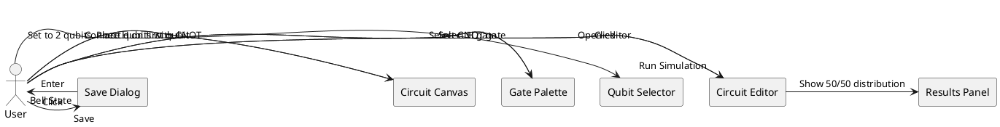
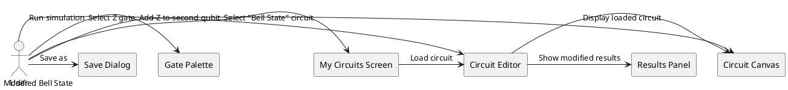
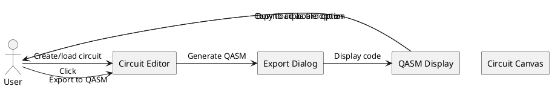

# UI Requirements for Quantum Circuit Editor

## 1. Overview

Based on product management requirements and the existing functional requirements for the Quantum Circuit Editor MVP, this document outlines the comprehensive UI/UX requirements. The Quantum Circuit Editor is designed as an educational tool for students and quantum computing enthusiasts with little to no prior quantum computing or programming experience.

## 2. Screen Structure

The application should have a minimal screen structure to reduce complexity:

### Main Screens:
1. **Landing Screen** - Introduction and login
2. **Circuit Editor Workspace** - Primary interface for circuit design and simulation
3. **My Circuits Screen** - List of saved circuits
4. **Help/Tutorial Screen** - Educational guidance for new users

## 3. User Flow Diagrams

### 3.1 First-time User Flow

### 3.2 Circuit Creation and Simulation Flow

### 3.3 Save and Export Flow

### 3.4 Circuit Management Flow

## 4. Detailed Screen Requirements

### 4.1 Landing Screen

**Purpose**: Introduce the application and authenticate users

**Requirements**:
- Clean, educational-focused welcome message explaining the purpose of the tool
- Login button with Google authentication
- Option to continue as a guest (if authentication is optional for basic usage)
- Brief visual showcase of the app's capabilities
- Link to help/tutorial resources
- Responsive design that works on desktop browsers

**User Experience Considerations**:
- No technical jargon that might intimidate beginners
- Clear call-to-action for getting started
- Visually appealing quantum circuit illustrations

### 4.2 Circuit Editor Workspace

**Purpose**: Primary interface for creating, editing, and simulating quantum circuits

**Layout Requirements**:
- Single-page design with distinct functional areas to minimize navigation
- Split into 3-4 panels that can be collapsed/expanded as needed

**Components**:

1. **Header/Toolbar Area**
   - Application logo/name
   - User account indicator
   - Save/Load buttons
   - Export to QASM button
   - Help/Tutorial button
   - Circuit name/description field

2. **Gate Palette Panel**
   - Clearly labeled basic gates (X, Y, Z, H, CNOT) with visual representations
   - Gates organized in a logical manner (single-qubit vs. multi-qubit)
   - Tooltip help for each gate explaining its function
   - Drag handles or clear visual indication gates can be dragged

3. **Circuit Canvas Area**
   - Horizontal qubit lines (2-5 qubits)
   - Grid/snap functionality for precise gate placement
   - Time flows left-to-right along qubit lines
   - Visual distinction between control and target qubits for multi-qubit gates
   - Clear visual feedback when gates are placed
   - Delete zone or trash icon for removing gates
   - Empty state with guidance for new users

4. **Control Panel Area**
   - Number of qubits selector (2-5)
   - "Run Simulation" button with clear visual prominence
   - Circuit reset/clear button
   - Circuit parameters (if applicable)

5. **Results Panel**
   - Initially collapsed when no simulation has been run
   - Expands to show probability distribution after simulation
   - Bar chart visualization of measurement outcomes
   - Option to re-run simulation
   - Clear explanation of results for educational purposes

**Interaction Requirements**:
- Gates must be draggable from palette to circuit
- Gates already on the circuit must be movable/repositionable
- Visual feedback during drag operations (shadow, highlight valid drop zones)
- Gates snap to correct positions on qubit lines
- CNOT gate must clearly show connection between control and target qubits
- Double-click on gate shows additional information or parameters (if applicable)
- Hover states for all interactive elements

**Responsive Behavior**:
- Optimized for desktop use (primary educational context)
- Side panels collapse to icons on smaller screens
- Maintain minimum functional size for circuit canvas

### 4.3 My Circuits Screen

**Purpose**: Manage saved quantum circuits

**Requirements**:
- List view of saved circuits with:
  - Circuit name
  - Creation/modification date
  - Small thumbnail preview of circuit (if feasible)
  - Quick actions (Load, Delete, Export)
- Sort/filter options (by date, name)
- Search functionality for finding specific circuits
- Empty state with guidance for new users
- Responsive grid layout that adapts to screen size
- Bulk operations for managing multiple circuits

**User Experience Considerations**:
- Confirmation dialog before deletion
- Visual indication of recently accessed circuits
- Preview capability before loading a circuit

### 4.4 Help/Tutorial Screen

**Purpose**: Educational guidance for new users

**Requirements**:
- Step-by-step interactive tutorial
- Visual explanations of quantum gates and their effects
- Example circuits with explanations
- Glossary of quantum computing terms
- FAQ section covering common questions
- Progressive disclosure of information (basic → advanced)
- Links to additional educational resources

**Tutorial Flow**:
1. Introduction to the interface
2. Creating your first circuit (adding single gates)
3. Using multi-qubit gates
4. Running a simulation
5. Understanding results
6. Saving and exporting

### 4.5 Authentication Flow

**Purpose**: Securely authenticate users while providing a smooth user experience with fallback options

**Authentication Methods**:
1. **Google Authentication** - Primary authentication method
2. **Guest Mode** - Limited functionality access without authentication

**Authentication Flow Requirements**:

1. **Initial Authentication**
   - Clear visual distinction between Google login and Guest mode options
   - Explanatory text indicating the benefits of authenticated usage vs. guest mode
   - Privacy policy and data usage information accessible before authentication
   - Remember me option for returning users

2. **Authentication Success**
   - Clear visual feedback upon successful authentication
   - Smooth transition to Circuit Editor Workspace
   - User account information displayed in header (username, profile picture if available)
   - First-time user detection to trigger optional tutorial

3. **Authentication Failure Handling**
   - Specific, user-friendly error messages for different failure scenarios:
     - Network connectivity issues
     - Invalid credentials
     - Service unavailability
     - Account-related issues
   - Retry options with clear guidance
   - Fallback to guest mode option with explanation of limitations

4. **Guest Mode Limitations**
   - Clear indication of guest mode status in the UI
   - Visual cues next to features that require authentication
   - Prompt to authenticate when attempting to use restricted features
   - Session persistence limitations clearly explained
   - Option to authenticate and convert current work to saved account at any time

5. **Session Management**
   - Session timeout warning 5 minutes before expiration
   - Option to extend session without losing work
   - Auto-save of current circuit state before authentication-related transitions
   - Graceful handling of authentication loss during active usage
   - Recovery of work in progress if authentication is re-established

6. **Offline Usage** (Post MVP)
   - Clear indication of offline status in the UI
   - Automatic transition to offline mode when connectivity is lost
   - Local storage of work in progress when offline
   - Synchronization process when connectivity is restored
   - Conflict resolution UI if local and server states differ after reconnection

7. **Authentication State Transitions**
   - Prevent work loss during authentication state changes
   - Confirmation dialogs before actions that might affect unsaved work
   - Visual indicators during authentication-related background processes
   - Ability to cancel authentication processes that take too long

**User Experience Considerations**:
- Authentication should not be a barrier to starting exploration for new users
- All authentication-related error messages should be friendly and jargon-free
- Authentication state should be clearly visible at all times
- Transitions between authenticated and unauthenticated states should preserve user work

**Security Considerations**:
- No storage of authentication credentials on client side
- Secure token management with appropriate expiration
- Clear indication of secure connection status
- Option to explicitly log out from all screens
- Automatic session termination after extended inactivity

## 5. Use Case Implementations

### 5.1 Use Case: Creating a Basic Bell State Circuit

**User Flow**:

**UI Requirements**:
- Visual guidance showing proper placement of H gate
- Clear visual representation of CNOT connection between qubits
- Immediate visual feedback when simulation completes
- Intuitive visualization of the probability distribution
- Simple save dialog with suggested name

### 5.2 Use Case: Loading and Modifying a Saved Circuit

**User Flow**:

**UI Requirements**:
- Clear loading indication when circuit is being retrieved
- Preservation of the entire circuit state when loading
- Visual indication that circuit has been modified from saved version
- Option to save as new circuit or overwrite existing one

### 5.3 Use Case: Exporting to QASM

**User Flow**:

**UI Requirements**:
- Export button readily available in the main toolbar
- Modal dialog showing generated QASM code
- Syntax highlighting for QASM code
- Copy to clipboard button with confirmation feedback
- Download option that generates appropriately named file

## 6. UI States and Transitions

### 6.1 Circuit Editor States
1. **Empty State**: New circuit, no gates placed
2. **Editing State**: Circuit with gates being added/modified
3. **Simulating State**: Processing simulation (loading indicator)
4. **Results State**: Showing simulation results
5. **Error State**: Displaying validation errors or simulation failures

### 6.2 Special UI Considerations

**First-time User Experience**:
- Optional guided tour highlighting key UI elements
- Tooltips for main functions
- Sample circuit templates accessible from empty state

**Error Handling**:
- Clear visual indication of invalid gate placements
- Helpful error messages for simulation failures
- Suggestion of fixes for common errors

**Feedback Mechanisms**:
- Visual confirmation for save operations
- Animation for successful simulation completion
- Progress indication for longer operations

## 7. Visual Design Guidelines

While detailed visual design is not part of these requirements, the UI should follow these principles:

- **Clean and Minimal**: Focus on circuit and results without visual clutter
- **Educational Focus**: Visual design that supports understanding of quantum concepts
- **Clear Hierarchy**: Important actions and information should be visually prominent
- **Consistent Patterns**: Use consistent interaction patterns throughout the application
- **Color Usage**: Use color to convey meaning, not just decoration (e.g., different colors for different gate types)
- **Accessibility**: Sufficient contrast, readable text sizes, and keyboard navigation support

## 8. Mobile Considerations

While the primary focus is desktop usage in educational settings, the interface should:

- Be viewable on tablets and mobile devices
- Collapse less important panels on smaller screens
- Maintain core functionality even on reduced screen sizes
- Consider touch interaction for drag-and-drop operations

## 9. Performance Expectations

The UI should:
- Provide immediate feedback for user actions
- Handle circuit updates smoothly without perceptible lag
- Display loading indicators for operations exceeding 300ms
- Optimize canvas rendering for efficient updates
- Degrade gracefully under poor network conditions

## 10. Summary

The Quantum Circuit Editor UI should focus on creating an intuitive, educational experience with minimal screens and clear workflows. By focusing on a single-page application approach with the Circuit Editor Workspace as the central interface, we can create a streamlined experience that supports the core functionality while minimizing complexity for novice users.

The design should prioritize:
1. Intuitive drag-and-drop circuit construction
2. Clear visual feedback during all operations
3. Educational guidance integrated into the interface
4. Simple simulation and results visualization
5. Straightforward saving and exporting capabilities

This approach aligns with the MVP goals of creating an accessible educational tool for quantum computing concepts while keeping the interface simple and focused.

## 11. MVP Simplification Strategy

To address the balance between educational complexity and user-friendly simplicity, the following MVP simplification strategies will be implemented:

### 11.1 Phased Feature Rollout

**Core MVP Features** (Phase 1):
- Circuit Editor Workspace with basic functionality only
- Limited gate set (H, X, Z, CNOT only) to reduce initial complexity
- Basic simulation capabilities with simplified results visualization
- Essential save/load functionality without complex management features
- Minimal inline help (tooltips only) instead of full tutorial system

**Post-MVP Features** (Phase 2+):
- Advanced gates and extended palette options
- Comprehensive tutorial system and Help Screen
- Enhanced circuit management in My Circuits Screen
- Advanced export options and sharing features
- Complex result visualizations and analytical tools

### 11.2 UI Simplifications for MVP

1. **Reduce Screen Count**:
   - Consolidate Landing Screen and Circuit Editor into a single entry point
   - Make My Circuits a panel within the main editor rather than a separate screen
   - Defer comprehensive Help/Tutorial Screen to post-MVP, use inline guidance instead

2. **Streamline Circuit Editor Components**:
   - Limit the initial qubit count to 3 maximum for MVP (expandable in later versions)
   - Simplify the gate palette to show only the most essential gates
   - Use progressive disclosure techniques: hide advanced features until basic ones are mastered

3. **Tutorial Approach**:
   - Replace full tutorial screen with targeted, context-sensitive help
   - Implement an optional "guided tour" that highlights one feature at a time
   - Use subtle hints and suggestions rather than lengthy explanations

4. **Simplified User Flows**:
   - Focus on the core user flow: create circuit → run simulation → view results
   - Defer complex management features (bulk operations, tagging, advanced sorting)
   - Limit export options to a single, simple format for MVP

### 11.3 Progressive Feature Introduction

To avoid overwhelming new users while still building toward the full feature set:

1. **Feature Gates**:
   - Introduce advanced features only after user has successfully created basic circuits
   - Use "New Feature" badges to gradually highlight capabilities as users progress

2. **Default Configurations**:
   - Start with simplified view configurations that can be expanded as users gain confidence
   - Pre-collapse optional panels by default, allowing users to discover them organically

3. **Achievement-Based Progression**:
   - Unlock advanced features after users successfully complete basic operations
   - Create a natural learning progression that introduces complexity gradually

### 11.4 MVP Features Priority Matrix

| Feature | Priority | MVP Status | Complexity Reduction Strategy |
|---------|----------|------------|-------------------------------|
| Basic Circuit Canvas | High | Include | Limit to 3 qubits maximum |
| Essential Gate Set | High | Include | Only H, X, Z, CNOT gates |
| Basic Simulation | High | Include | Simple visualization only |
| Save/Load | High | Include | Basic functionality without management |
| Tooltips | Medium | Include | Minimal, focused on gate function |
| Export to QASM | Medium | Include | Simple export without options |
| Full Tutorial | Low | Defer | Replace with contextual hints |
| My Circuits Management | Low | Defer | Simplify to basic list view |
| Advanced Gates | Low | Defer | Introduce in later releases |

By implementing these simplification strategies, the MVP will maintain focus on the core educational experience while reducing cognitive load for new users. This approach creates a solid foundation that can be expanded upon in subsequent releases as users become more comfortable with the basic concepts.

## 12. Functional Requirements Alignment

This section explicitly maps each UI requirement to the corresponding functional requirement in the [Functional Requirements for Quantum Circuit Editor MVP](/docs/functional_requirements_mvp.md) document to ensure complete alignment and prevent scope creep.

### 12.1 User Interface Alignment

| UI Requirement | Functional Requirement | Implementation Notes |
|----------------|------------------------|---------------------|
| Circuit Editor Workspace with drag-and-drop interface | 1.1. Provide a web-based drag-and-drop interface for creating quantum circuits | The Circuit Canvas Area implements this with drag handles and visual feedback |
| Visual feedback during circuit construction | 1.2. Support simple and intuitive circuit construction with visual feedback | Implemented through highlighting valid drop zones and shadows during drag operations |
| Clear gate representations in Circuit Canvas | 1.3. Enable basic circuit visualization with clear gate representation | Gates have distinct visual designs and clear labeling |
| Simplified UI in MVP Simplification Strategy | 1.4. Implement a clean, straightforward UI avoiding overbloated features | Features prioritized in section 11.4 MVP Features Priority Matrix |

### 12.2 Quantum Circuit Components Alignment

| UI Requirement | Functional Requirement | Implementation Notes |
|----------------|------------------------|---------------------|
| Gate Palette with X, Y, Z, H, CNOT gates | 2.1. Support basic quantum gates only | Gate Palette Panel includes only the required gates with visual representations |
| Number of qubits selector (2-5) in Control Panel | 2.2. Allow circuits of 2-5 qubits for educational purposes | Limited to 3 qubits in MVP (section 11.2) with expansion to 5 in later versions |
| Drag-and-drop gate placement in Circuit Canvas | 2.3. Enable simple circuit construction by dragging gates onto qubit lines | Implemented through Interaction Requirements in section 4.2 |

### 12.3 Simulation Capabilities Alignment

| UI Requirement | Functional Requirement | Implementation Notes |
|----------------|------------------------|---------------------|
| "Run Simulation" button in Control Panel | 3.1. Provide basic circuit simulation functionality | Primary action button with visual prominence |
| Bar chart visualization in Results Panel | 3.2. Display probability distribution of measurement outcomes | Results Panel expands after simulation with measurement outcomes |
| Clear explanation of results in Results Panel | 3.3. Include simple visualization of circuit execution results | Educational explanations included with results |
| Circuit optimization for 2-5 qubits | 3.4. Optimize simulation for small educational circuits (2-5 qubits) | Canvas and rendering optimized for this scale |

### 12.4 Export Functionality Alignment

| UI Requirement | Functional Requirement | Implementation Notes |
|----------------|------------------------|---------------------|
| Export to QASM button and workflow | 4.1. Support export to QASM format | Implemented in Header/Toolbar Area and through Export Dialog |
| Save/Load buttons and My Circuits Screen | 4.2. Enable saving and loading of circuit designs | Save Dialog and My Circuits Screen implementation |

### 12.5 Non-Functional Requirements Alignment

| UI Requirement | Functional Requirement | Implementation Notes |
|----------------|------------------------|---------------------|
| Performance expectations in section 9 | 1.1. Responsive interface suitable for educational use | Defined specific loading indicators and rendering optimization |
| Clean UI design for beginners (section 7) | 2.1. Intuitive enough for beginners with no quantum computing experience | Educational focus in visual design guidelines |
| Visual feedback during operations (section 6) | 2.2. Clear visual feedback during circuit construction | Defined in Interaction Requirements and Special UI Considerations |
| Help/Tutorial features (section 4.4) | 2.3. Simple help/tutorial system to guide new users | Simplified to tooltips and contextual help for MVP |
| Responsive design for desktop browsers | 3.1. Web-based application compatible with major browsers | Defined in Responsive Behavior section |

### 12.6 Out of Scope UI Elements

The following elements are explicitly excluded from the UI as they correspond to out-of-scope functional requirements:

1. UI components for extended gate sets beyond the specified basic gates
2. Custom gate creation interface
3. Hardware execution configuration panels
4. Advanced visualization tools such as Bloch sphere representations
5. Noise modeling controls
6. UI elements supporting circuits larger than 5 qubits
7. Collaboration features such as sharing or multi-user editing
8. Integration panels for classical computing tools

This alignment ensures that all UI requirements directly support the defined functional requirements without introducing scope creep, while providing clear traceability between the two documents.
