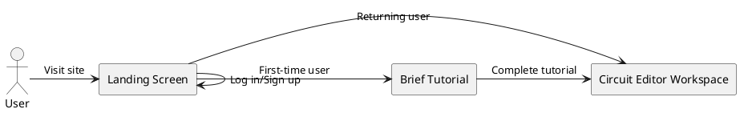
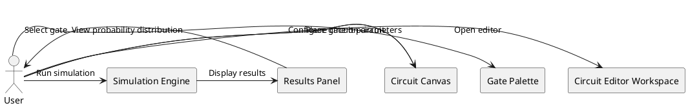
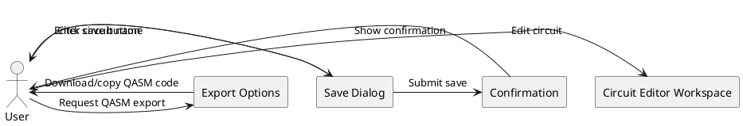
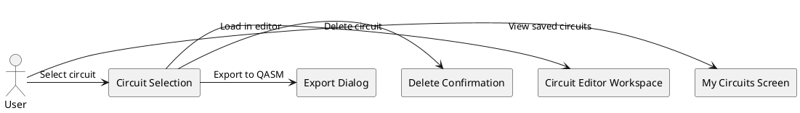
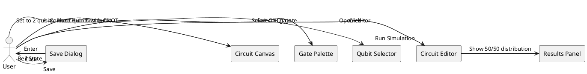
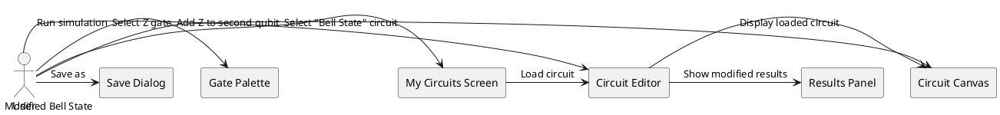
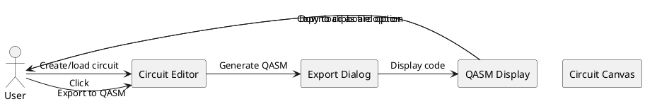

# UI Requirements for Quantum Circuit Editor

## 1. Overview

Based on product management requirements and the existing functional requirements for the Quantum Circuit Editor MVP, this document outlines the comprehensive UI/UX requirements. The Quantum Circuit Editor is designed as an educational tool for students and quantum computing enthusiasts with little to no prior quantum computing or programming experience.

## 2. Screen Structure

The application should have a minimal screen structure to reduce complexity:

### Main Screens:
1. **Landing Screen** - Introduction and login
2. **Circuit Editor Workspace** - Primary interface for circuit design and simulation
3. **My Circuits Screen** - List of saved circuits
4. **Help/Tutorial Screen** - Educational guidance for new users

## 3. User Flow Diagrams

### 3.1 First-time User Flow

### 3.2 Circuit Creation and Simulation Flow

### 3.3 Save and Export Flow

### 3.4 Circuit Management Flow

## 4. Detailed Screen Requirements

### 4.1 Landing Screen

**Purpose**: Introduce the application and authenticate users

**Requirements**:
- Clean, educational-focused welcome message explaining the purpose of the tool
- Login button with Google authentication
- Option to continue as a guest (if authentication is optional for basic usage)
- Brief visual showcase of the app's capabilities
- Link to help/tutorial resources
- Responsive design that works on desktop browsers

**User Experience Considerations**:
- No technical jargon that might intimidate beginners
- Clear call-to-action for getting started
- Visually appealing quantum circuit illustrations

### 4.2 Circuit Editor Workspace

**Purpose**: Primary interface for creating, editing, and simulating quantum circuits

**Layout Requirements**:
- Single-page design with distinct functional areas to minimize navigation
- Split into 3-4 panels that can be collapsed/expanded as needed

**Components**:

1. **Header/Toolbar Area**
   - Application logo/name
   - User account indicator
   - Save/Load buttons
   - Export to QASM button
   - Help/Tutorial button
   - Circuit name/description field

2. **Gate Palette Panel**
   - Clearly labeled basic gates (X, Y, Z, H, CNOT) with visual representations
   - Gates organized in a logical manner (single-qubit vs. multi-qubit)
   - Tooltip help for each gate explaining its function
   - Drag handles or clear visual indication gates can be dragged

3. **Circuit Canvas Area**
   - Horizontal qubit lines (2-5 qubits)
   - Grid/snap functionality for precise gate placement
   - Time flows left-to-right along qubit lines
   - Visual distinction between control and target qubits for multi-qubit gates
   - Clear visual feedback when gates are placed
   - Delete zone or trash icon for removing gates
   - Empty state with guidance for new users

4. **Control Panel Area**
   - Number of qubits selector (2-5)
   - "Run Simulation" button with clear visual prominence
   - Circuit reset/clear button
   - Circuit parameters (if applicable)

5. **Results Panel**
   - Initially collapsed when no simulation has been run
   - Expands to show probability distribution after simulation
   - Bar chart visualization of measurement outcomes
   - Option to re-run simulation
   - Clear explanation of results for educational purposes

**Interaction Requirements**:
- Gates must be draggable from palette to circuit
- Gates already on the circuit must be movable/repositionable
- Visual feedback during drag operations (shadow, highlight valid drop zones)
- Gates snap to correct positions on qubit lines
- CNOT gate must clearly show connection between control and target qubits
- Double-click on gate shows additional information or parameters (if applicable)
- Hover states for all interactive elements

**Responsive Behavior**:
- Optimized for desktop use (primary educational context)
- Side panels collapse to icons on smaller screens
- Maintain minimum functional size for circuit canvas

### 4.3 My Circuits Screen

**Purpose**: Manage saved quantum circuits

**Requirements**:
- List view of saved circuits with:
  - Circuit name
  - Creation/modification date
  - Small thumbnail preview of circuit (if feasible)
  - Quick actions (Load, Delete, Export)
- Sort/filter options (by date, name)
- Search functionality for finding specific circuits
- Empty state with guidance for new users
- Responsive grid layout that adapts to screen size
- Bulk operations for managing multiple circuits

**User Experience Considerations**:
- Confirmation dialog before deletion
- Visual indication of recently accessed circuits
- Preview capability before loading a circuit

### 4.4 Help/Tutorial Screen

**Purpose**: Educational guidance for new users

**Requirements**:
- Step-by-step interactive tutorial
- Visual explanations of quantum gates and their effects
- Example circuits with explanations
- Glossary of quantum computing terms
- FAQ section covering common questions
- Progressive disclosure of information (basic → advanced)
- Links to additional educational resources

**Tutorial Flow**:
1. Introduction to the interface
2. Creating your first circuit (adding single gates)
3. Using multi-qubit gates
4. Running a simulation
5. Understanding results
6. Saving and exporting

## 5. Use Case Implementations

### 5.1 Use Case: Creating a Basic Bell State Circuit

**User Flow**:

**UI Requirements**:
- Visual guidance showing proper placement of H gate
- Clear visual representation of CNOT connection between qubits
- Immediate visual feedback when simulation completes
- Intuitive visualization of the probability distribution
- Simple save dialog with suggested name

### 5.2 Use Case: Loading and Modifying a Saved Circuit

**User Flow**:

**UI Requirements**:
- Clear loading indication when circuit is being retrieved
- Preservation of the entire circuit state when loading
- Visual indication that circuit has been modified from saved version
- Option to save as new circuit or overwrite existing one

### 5.3 Use Case: Exporting to QASM

**User Flow**:

**UI Requirements**:
- Export button readily available in the main toolbar
- Modal dialog showing generated QASM code
- Syntax highlighting for QASM code
- Copy to clipboard button with confirmation feedback
- Download option that generates appropriately named file

## 6. UI States and Transitions

### 6.1 Circuit Editor States
1. **Empty State**: New circuit, no gates placed
2. **Editing State**: Circuit with gates being added/modified
3. **Simulating State**: Processing simulation (loading indicator)
4. **Results State**: Showing simulation results
5. **Error State**: Displaying validation errors or simulation failures

### 6.2 Special UI Considerations

**First-time User Experience**:
- Optional guided tour highlighting key UI elements
- Tooltips for main functions
- Sample circuit templates accessible from empty state

**Error Handling**:
- Clear visual indication of invalid gate placements
- Helpful error messages for simulation failures
- Suggestion of fixes for common errors

**Feedback Mechanisms**:
- Visual confirmation for save operations
- Animation for successful simulation completion
- Progress indication for longer operations

## 7. Visual Design Guidelines

While detailed visual design is not part of these requirements, the UI should follow these principles:

- **Clean and Minimal**: Focus on circuit and results without visual clutter
- **Educational Focus**: Visual design that supports understanding of quantum concepts
- **Clear Hierarchy**: Important actions and information should be visually prominent
- **Consistent Patterns**: Use consistent interaction patterns throughout the application
- **Color Usage**: Use color to convey meaning, not just decoration (e.g., different colors for different gate types)
- **Accessibility**: Sufficient contrast, readable text sizes, and keyboard navigation support

## 8. Mobile Considerations

While the primary focus is desktop usage in educational settings, the interface should:

- Be viewable on tablets and mobile devices
- Collapse less important panels on smaller screens
- Maintain core functionality even on reduced screen sizes
- Consider touch interaction for drag-and-drop operations

## 9. Performance Expectations

The UI should:
- Provide immediate feedback for user actions
- Handle circuit updates smoothly without perceptible lag
- Display loading indicators for operations exceeding 300ms
- Optimize canvas rendering for efficient updates
- Degrade gracefully under poor network conditions

## 10. Summary

The Quantum Circuit Editor UI should focus on creating an intuitive, educational experience with minimal screens and clear workflows. By focusing on a single-page application approach with the Circuit Editor Workspace as the central interface, we can create a streamlined experience that supports the core functionality while minimizing complexity for novice users.

The design should prioritize:
1. Intuitive drag-and-drop circuit construction
2. Clear visual feedback during all operations
3. Educational guidance integrated into the interface
4. Simple simulation and results visualization
5. Straightforward saving and exporting capabilities

This approach aligns with the MVP goals of creating an accessible educational tool for quantum computing concepts while keeping the interface simple and focused.